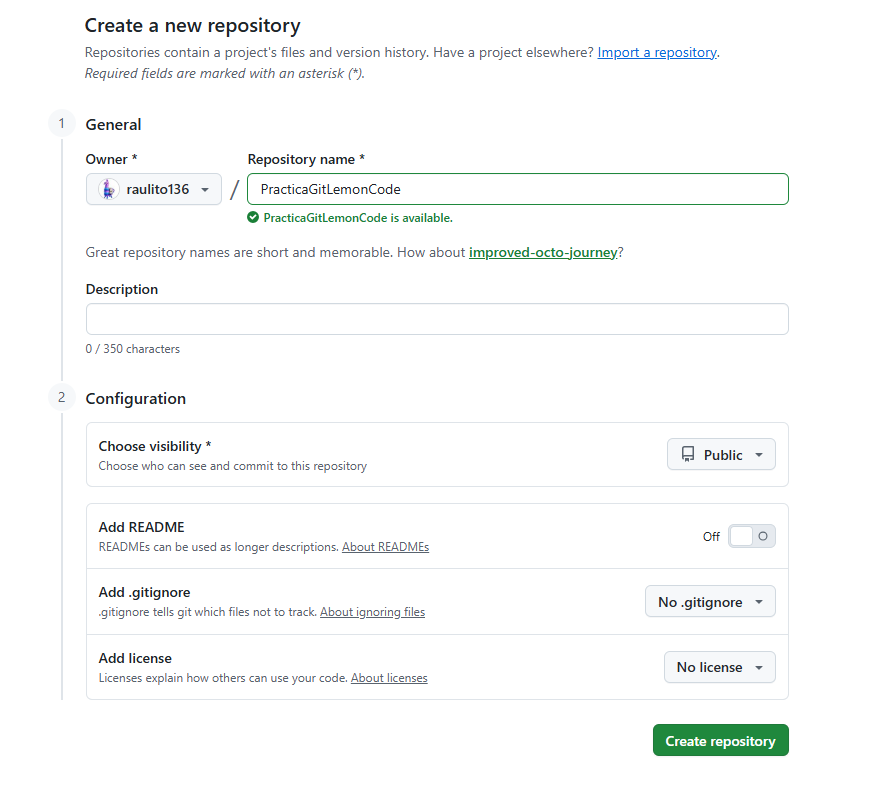
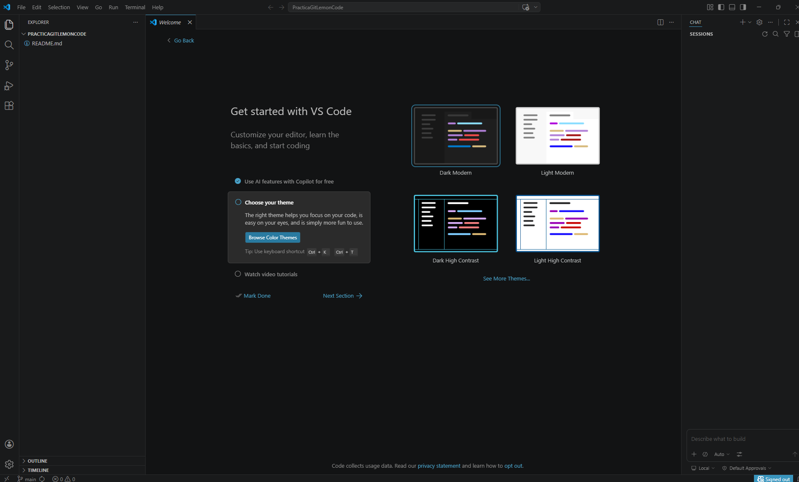
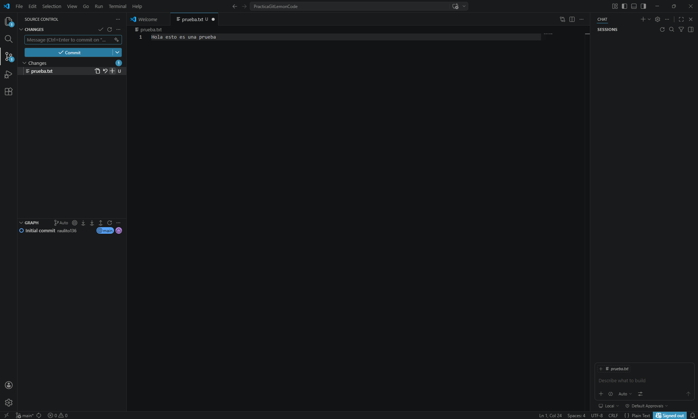
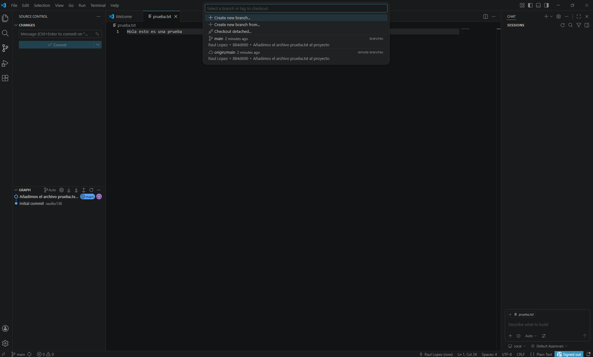
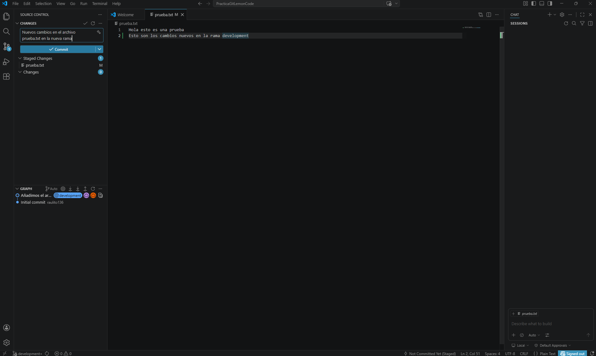
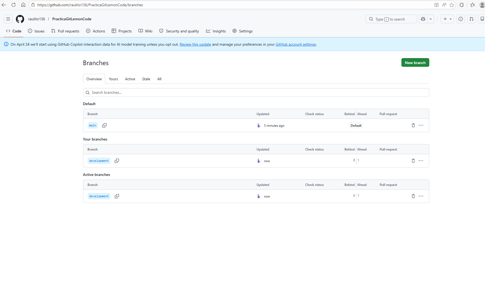
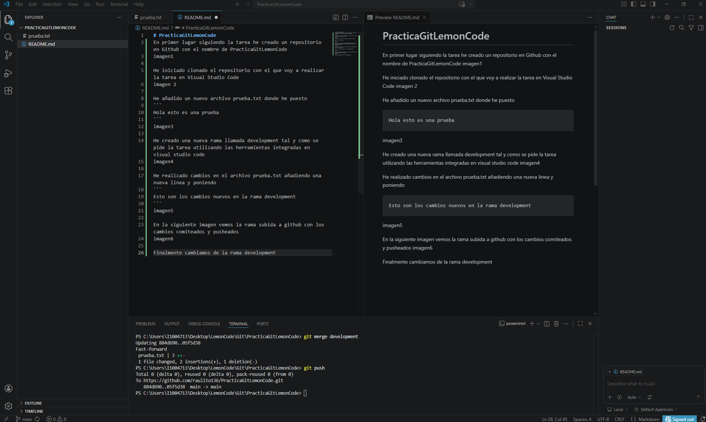

# PracticaGitLemonCode
En primer lugar siguiendo la tarea he creado un repositorio en Github con el nombre de PracticaGitLemonCode


***

He iniciado clonado el repositorio con el que voy a realizar la tarea en Visual Studio Code


***

He añadido un nuevo archivo prueba.txt donde he puesto
```
Hola esto es una prueba
```


***
He creado una nueva rama llamada development tal y como se pide la tarea utilizando las herramientas integradas en visual studio code


***
He realizado cambios en el archivo prueba.txt añadiendo una nueva linea y poniendo
```
Esto son los cambios nuevos en la rama development
```


***
En la siguiente imagen vemos la rama subida a github con los cambios comiteados y pusheados


***
Finalmente cambiamos de la rama development a la main y mergeamos y pusheamos los cambios


***